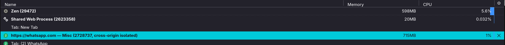
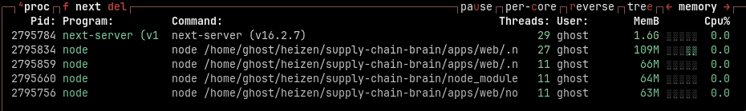

### Contents

* [Preface](#preface)
* [How it started out](#how-it-started-out)
* [The old laptop experience](#the-old-laptop-experience)
* [What I mean](#what-i-mean)
  * [Some examples of bad software](#some-examples-of-bad-software)
  * [Some examples of good software](#some-examples-of-good-software)
* [How I try to incorporate this into my work](#how-i-try-to-incorporate-this-into-my-work)
* [A final request](#a-final-request)

## Preface

This blog post is not like what some of the others I will be posting. The primary intention of this one is to discuss my take on how software should be written, what are the good things, the bad things, and what is my opinion on how the industry is looking like right now. When it comes to the new era of software that we're currently living in, I have one very major problem with it, and that goes back to my philosophy of software: "software should not assume the hardware".

This is a philosophy that has been shaped from my first experience starting into software development. I started my journey on a tiny Raspberry Pi 3B+ back in 2018. Now a pi is great. It is made to get people started into software and is supposed to be an educational tool. The timing for this however, led to me using that small board as my daily driver for over 2 years for all things related to development and software.

So when I was working with it, I was trying to run all these different things. Now obviously, if you're starting out in software, you'll use a friendly text editor like VS Code, Sublime, the typical list. You obviously need a browser and naturally, one does not simply walk into ~Mordor~ the world of software development without some music so if not spotify, then at least a browser tab streaming some music.

Now you can imagine how difficult it is to run any modern browser, a text editor like VSCode and having youtube going on in the background for music. Most modern software assumes that your machine has 16GBs of RAM if not more. This is a dangerous idea in my opinion because it permits software developers to take shortcuts and will lead to obsolecense of hardware as software starts being developed with higher hardware requirements.

To the people who are thinking, "why is he trying to use a pi? That is not a software development board". I agree with you. It is a prototyping board that can run linux. But it is running linux. While hardware constraints existed, better written software might have allowed me to use that old board in a much greater capacity. So while I get the argument that a good laptop is required for modern software development, an empty browser window is not doing anything, an empty VS Code window is not doing anything. Why would opening both crash the system even though the board met the "hardware requirements" of both software? Simple: They both assumed that I will run only 1 of them at a time.

## How it started out

So one fateful day I'm sitting and I'm working, trying to at least, and I open three files and obviously it crashes. After dealing with this for months, I had had enough. I start up a browser session to look for alternatives to VS Code. I try out sublime, neovim (I couldn't exit it at that time), atom and just about anything I could find at the time. In the end I settled for using sublime text editor for a while however using it alongside a browser was still a difficult endeavor for me leading to a lot of crashes especially when I was also playing music from the web.

What ended up happening was I continued this cycle of "Hey, if I want to use something how do I use it? How do I make it usable? How can I get something out of this Pi?" which eventually led me to start making the tools I use daily. The first thing I wanted to make was a voice assistant because it was the coolest thing I could come up with at that time.

So I got some speech-to-text software, text-to-speech software, all these different Python libraries which were terrible in hindsight but they were bleeding edge back at that time. I patched it together and suddenly I had something that I could use. Anything that I need to do on a regular basis, like Google searches etc etc, just getting some results out, getting some basic things done, and I wasn't using up a hundred percent of my resources.

Now at that time it wasn't a very performative tool, it wasn't AI, it was just a tool just taking what I speak, searching over whatever rules I'd given it, see what all commands match and just try to execute those. It was a very simple lookup, right? So naturally it wasn't taking up much system resources.

So I'm like hey, I listen to a lot of music, let me write a music player the idea being to take away as much dependancy on the browser as possible. So I do some research, come across yt-dlp and think, "I'll just use the library and I write something for it" and after a month or so of working on this, I had a simple GUI, a working music streaming tool that I was able to use actively (and integrate into the voice assistant).

And this is all mind you very very bad code. This is horrendous code but it worked. Comparing it to other pre-built versions of similar "streaming apps", it was a big improvement in performance because I never assumed that it would be run on anything more than a few megabites or RAM and a very underperforming CPU.

Case in point, this is not a web browser. It was a very specific tool aimed to solve a very very specific use case. Naturally, making a browser was out of scope for me. My intention was never to build a browser but rather to outsource some of the things I use my browser for to lighter alternatives.

## The old laptop experience

From 2020 till 22, I was using a macbook for attending online classes while continuing working on the Pi for everything outside of academics. However, when leaving for college, I took with me on old lenovo ideapad with an Intel Pentium processor and 16GB of RAM running debian with i3. This was the laptop I used throughout my first year of college. It certainly was an upgrade from the Pi. However, even with the additional resources, it still struggled with modern software and running a browser along with VS Code and dev servers running would still crash my laptop.

Again, the same argument can be applied that I am using a fossil for a laptop and complaining about it not being able to run modern software. We will get to this in a while. The point remained the same. I was actually quite comfortable using it once I fully switched over to neovim and restricted the number of browser tabs I kept open. Music was still an issue and so was watching videos but there was hardly much need for the latter.

Besides certain software running together, the system was quite up to speed for coding and development and I had no issues with it after installing my own applications and keeping the system debloated. The primary culprit was as usual, the web browser.

## What I mean

To explain things in relation to the present, I think the first thing I could do is give some concrete examples of what I'm talking about, identified in software that is being written now. Note, most of these are benchmarked on my current laptop (16GB LPDDR5 RAM, Ryzen 7 7730U) on an arch installation.

### Some examples of bad software

Some of these are outright software, some are tools/frameworks to write software.

##### 1. Zen Browser

Now I am daily driving this browser, but it is one of the worst pieces of software I've ever used in my life when it comes to its efficiency and assumptions about hardware. Just opening a few tabs takes up almost a gig of memory. It is terrible at memory management. The only reason I'm still using right now is that it offers some features that are very very useful to my workflow so I can't really switch from it without losing efficiency in my work.

##### 2. Whatsapp Web

It is one of my most used applications. It is one of the worst web applications I've ever used. I will not be discussing about the desktop app because there is no official desktop app for linux. Which is why I am following projects like [whats4linux](https://github.com/lugvitc/whats4linux). Whatsapp web after running for a day has taken up >4GB of RAM. For just a messaging app, I do not think I need to call this out as insanity.

##### 3. Electron

Electron has one of the largest adoption rates when it comes to making desktop applications and it is great for developers but it's horrible for the end user and it's for the same reason. A blank Electron app burns 80-150MB of RAM at launch just to boot Chromium and Node, and running a handful together (Slack, Discord, VS Code, Spotify) can chew through 1.5-2GB ([xda-developers](https://www.xda-developers.com/sick-every-pc-program-electron-app/)) — worth noting some argue the shared/read-only nature of Chromium's memory makes the raw numbers look worse than they are ([tauri-apps/tauri#5889](https://github.com/tauri-apps/tauri/issues/5889)), but the difference is still real and measurable next to a native app running on 10-15MB. Electron is a good concept with bad execution though it has allowed the evolution of better alternatives following similar patterns

This was also discussed in [This Better Stack podcast](https://www.youtube.com/watch?v=VuMf2ZVA0RE).

##### 4. NextJS
Another example of that is Next.js. Nowadays you'll see Next.js being thrown into almost any environment. Like just a couple of days ago somebody had shared a post with me where this person has made an end-to-end blog writing experience and it has Next.js, this, that, so many things and like if you're writing just a blog what functionality of Next.js are you using right because I use that platform the blogs do not require NextJS at all.

The only reason that NextJS might be there is because they wanted a fully integrated environment maybe, I'm not sure but why do you need that it's like developers stopped asking the question why. Like if I want to write a blog post I can just open it in any markdown or text editor with publishing being handled by the markdown metadata. I mean that's what I do here so why do you need Next.js? Why do you need a full database? Why do you need Supabase? What's with all these things?

##### 5. A bad Operating System

Going towards operating systems, I know you're expecting me to trash windows but in fact I intend to keep my criticism to the defaults of a linux distribution instead. I am talking about Ubuntu, the most popular "beginner friendly" distro.

Just because it's supposed to be user-friendly or beginner friendly doesn't mean it has to be unoptimized. Like, there is so many things going on over there that are not required. Like, it makes sense to run those things only when they achieve something. A lot of the things that are running in Ubuntu just don't achieve anything. Two concrete culprits: GNOME, Ubuntu's default desktop, idles at around 2GB of RAM and is consistently flagged as one of the heaviest desktop environments out there, next to lighter options like KDE Plasma, Xfce, Cinnamon, and MATE ([Yahoo Tech](https://tech.yahoo.com/general/articles/gnome-vs-kde-plasma-top-143019197.html)). And Snaps, Ubuntu's own packaging format, average 235MB extracted per package with only 30% of them updated within the past year, and are known to take up to a minute to load ([arXiv 2507.00786](https://arxiv.org/html/2507.00786v1)).

Now, a bit more context here, why I say this. I have been an active member of [The Linux Club](https://lugvic.tech) of my college for the past year. I've been using Linux for the past five. I really never understood how people keep justifying GNOME's 2GB idle with "it looks good". That is not a valid argument for something sucking 1/8th if not more of your available resources.

### Some examples of good software

Now I have to also discuss some good software, especially for the same examples that I have just given right now, obviously.

So for VS Code, the modern alternative is Zed, an IDE, a text editor. It's fantastic. Takes so much less resources, so much faster, so much more efficient. Benchmarks back this up: Zed can run on a fraction of VS Code's memory (222MB vs 3,549MB in one test), starts up to 10x faster, and holds ~2ms input latency versus VS Code's ~12ms under load ([tech-insider.org](https://tech-insider.org/zed-vs-vscode-2026/)). And yeah, it's new, it's written in Rust and trust me when I say this Rust is amazing at this.

So yeah, that is what you can achieve if you intend to write software in this manner.

When it comes to browser, Zen Browser sucks in memory management, but so far I haven't found any other browser with all the same functionality. A good browser in general is Microsoft Edge, does not take a lot of resources, runs smoothly enough.

But yeah, it browsers can be a bit conflicting for most people in place of Electron Rust has developed some very very nice native app solutions which work fantastically well. The Zed community itself has, I think, released one or two over there. So Next.js, again, it does a lot of things but it is used in places where it shouldn't be used.

So more on this topic in a bit but essentially you can do everything Next.js is doing with a variety of other frameworks that aren't that bloated. For example if in the earlier example I have given right Next.js is for a blog website what the hell are you doing? Just use Astro Astro works like a charm otherwise if you want the reactivity you want the responsiveness just go with something like SvelteKit. And it's not just vibes: a SvelteKit hello-world ships an 18KB gzipped bundle against Next.js's 70KB, a real page test showed a 65% smaller bundle, SvelteKit handled 1,200 requests/sec against Next.js's 850, and its dev server cold-starts in 1.2s versus Next.js's 6-8s ([SvelteKit vs Next.js 16 benchmarks](https://dev.to/saqibshah/sveltekit-vs-nextjs-16-2026-performance-benchmarks-21pj), [Markaicode](https://markaicode.com/vs/sveltekit-vs-nextjs/)). That gap is Next.js shipping the entire React runtime in every bundle regardless of whether the page needs it, while SvelteKit compiles itself away.

If you are a linux user or are familiar with linux distros I'm sure you'd agree Ubuntu isn't the best option out there. You can go a bit more bare-bones with something like Debian, which works very well, or Fedora, another good option. I'm personally on Arch because I wanted full customizability, but I'll admit Arch is overkill for most users.

There are some user-friendly distros out there now for Arch. You can check out Stratos Linux. It has the package managers for everything. It's a project that spun out of the college club and besides that I think Omarchy is on the hype train now but I don't support hype trains there are good options for almost everything.

You can replace all these components that we use as developers with something that's less that's less taxing for the end user and it still works that's the entire point.

## How I try to incorporate this into my work

So when I am working, right, when I am planning or w building something, there is a couple of things I keep in mind. It's like a thought process, just a checkbook from my side. And this is just something I recommend in general when it comes to writing software.

So the first one is the tool that you use should give the end user the best experience without assuming on the hardware. This is just as simple as what I've been saying up till now. Right, I'm not saying use plain HTMLs just because it is very light. I'm saying use CSS, use whatever framework you want, but make sure that it is not so heavy that the end user is struggling to run it, or another developer is struggling to run it, as is the case with Next.js.

The second thing that I keep in mind and I also recommend is do not use a package or a tool for just using a very small subset of their capabilities. It's like you have a Swiss Army knife and you're only using the knife. Like just use a regular knife at that point, just buy a switchblade.

It's like having a screwdriver kit where you're only using the Phillips head of one size. Doesn't make sense, right? So why carry the extra load when you there will okay, especially in TypeScript and JavaScript there is guaranteed going to be one package that solves exactly what you're looking for and not the rest of the things that you don't need.

So the onus is on the developer to explore and ensure that they're not using a Swiss Army knife where it doesn't belong.

The third thing is good software can run on a toaster. Not literally of course but it's just a reminder that hey your software should not cost a lot to run.

For example, on my VPS I have an observability stack with cAdvisor, node exporter, the good ol' Prometheus, Grafana, all of those things. All of my applications that I have developed and run take roughly 5% CPU and around 2GB memory total. This observability stack takes up 25 to 30% CPU and 2GB of memory. So it doesn't make sense. What's the point of having this disproportionate observability stack? For this purpose as well I have started working on a solution which also includes some additional benefits but more on that in a later post.

Modern software and frameworks that are cropping up recently however give me a lot of hope. With major tooling being backed by Rust and Golang have led to improvements in performance and efficiency. I am personally pivotting toward incorporating more native solutions for my personal projects and am actively adopting some newer frameworks, aggressively moving toward golang and rust for development. I think a great example is [FastrApi](https://github.com/ppmpreetham/fastrapi.git).

## A final request

In the end I just want to say, if you are an engineer, please don't stop asking why the software you are making needs those "minimum system requirements". Do not stop asking "if I make this today, would it still work on systems from 5 years ago?". Asking questions makes a better product without making end users struggle to run it alongside their usual workflows.

Improve your tools: your editor, your knowledge and your tech stack. This goes a long way in forcing you to write better software. It doesn't have to be rust or go. But even within the ecosystem, you can have better tools.

Good sofware is not easy to write, there are always bugs and issues that need to be fixed. But if we are not writing good software, are we even software engineers?

In parting I would just like to remind you that this is just my philosophy when it comes to software engineering and I'd be more than happy to read more about yours. If you have written something similar, please feel free to share!
